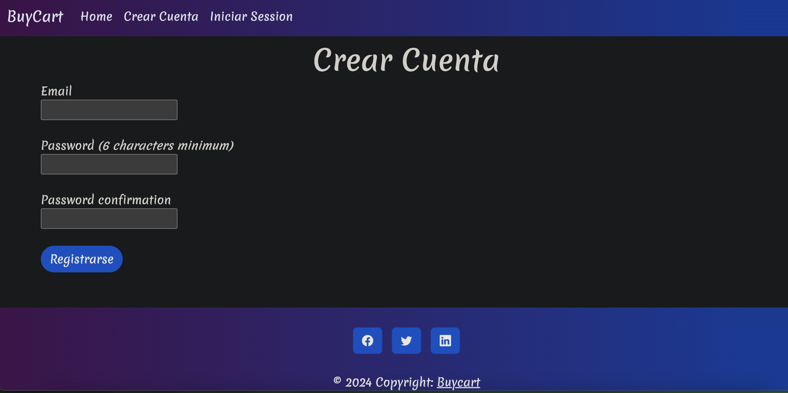

# Buy_Cart App




Iniciamos el proyecto con el siguiente comando:
```bash
rails new buy_cart
```

Creando el scaffold de la tabla articulos con los campos nombre y precio

```bash
 rails g scaffold article name price:integer
```
Luego hacemos la migracion
```bash
rails db:migrate
```

Definiendo la ruta raiz en el archivo config/route
```ruby
root "articles#index"
```

Implementando la Gema Devise en el gemfile
```ruby
# Gem authentication devise
gem "devise"
```

creando los recursos para el modelo devise
```bash
rails g devise:install
```

Copiamos la siguiente linea en el archivo: 

* config/environments/development.rb: en cualquier linea
```ruby
config.action_mailer.default_url_options = { host: 'localhost', port: 3000 }
```

Ahora copiamos los notice y alert en:
* layouts/application.html.erb arriba de la etiqueta yied

```ruby
<p class="notice"><%= notice %></p>
<p class="alert"><%= alert %></p>
```

Asignando el modelo User a devise para la autenticacion

```bash
rails g devise user
```

Realizamos la migracion para el modelo de devise con el comando
```bash
rails g migration  addUserToArticles user:references
rails db:migrate
```

Ahora creamos la relacion entre la tabla article y la tabla user, 

* En el modelo de user colocamos
```ruby
has_many :articles
```

* En el modelo de article colocamos
```ruby
 belongs_to :user
 ```

 En el controlador de article copiamos lo siguiente:
 ```ruby
 before_action :set_article, only: %i[ show edit update destroy ]
 before_action :authenticate_user!, except: :index
 ```
 Luego probamos la relacion en la consola de rails

```bash
  Article.last
  Article Load (0.3ms)  SELECT "articles".* FROM "articles"
 => 
[#<Article:0x000000011283f988
  id: 1,
  name: "pelota",
  price: 899,
  created_at: Sun, 21 Apr 2024 02:33:50.362934000 UTC +00:00,
  updated_at: Sun, 21 Apr 2024 02:33:50.362934000 UTC +00:00,
  user_id: nil>] 
3.2.1 :005 > a = _
 => 
[#<Article:0x000000011283f988
```

 La variable "a" esta guardando el ultimo valor ejecutado en 
 consola que es Article.last


```bash
3.2.1 :008 > a = Article.update(user_id: 1)
  Article Load (0.4ms)  SELECT "articles".* FROM "articles"
  TRANSACTION (0.2ms)  begin transaction
  User Load (0.1ms)  SELECT "users".* FROM "users" WHERE "users"."id" = ? LIMIT ?  [["id", 1], ["LIMIT", 1]]
  Article Update (0.8ms)  UPDATE "articles" SET "updated_at" = ?, "user_id" = ? WHERE "articles"."id" = ?  [["updated_at", "2024-04-21 03:17:57.104993"], ["user_id", 1], ["id", 1]]
  TRANSACTION (1.1ms)  commit transaction
```
  A la variable "a" le estamos asignando el modelo Article lo actualiza
  con el dato faltante que es el valor de user_id

```bash
3.2.1 :009 > a
 => 
[#<Article:0x0000000114d35828
  id: 1,
  name: "pelota",
  price: 899,
  created_at: Sun, 21 Apr 2024 02:33:50.362934000 UTC +00:00,
  updated_at: Sun, 21 Apr 2024 03:17:57.104993000 UTC +00:00,
  user_id: 1>] 
```
 Retornamos el valor de la variable "a" actualizada con el user_id

  ```bash
  3.2.1 :011 > User.last.articles
  User Load (0.3ms)  SELECT "users".* FROM "users" ORDER BY "users"."id" DESC LIMIT ?  [["LIMIT", 1]]
  Article Load (0.2ms)  SELECT "articles".* FROM "articles" WHERE "articles"."user_id" = ?  [["user_id", 1]]
 => 
[#<Article:0x0000000112519380
  id: 1,
  name: "pelota",
  price: 899,
  created_at: Sun, 21 Apr 2024 02:33:50.362934000 UTC +00:00,
  updated_at: Sun, 21 Apr 2024 03:17:57.104993000 UTC +00:00,
  user_id: 1>] 
  ```

  Aca se probo la relacion entre user y article (relacion uno a muchos)

  ```bash
  3.2.1 :013 > Article.last.user
  Article Load (0.4ms)  SELECT "articles".* FROM "articles" ORDER BY "articles"."id" DESC LIMIT ?  [["LIMIT", 1]]
  User Load (0.1ms)  SELECT "users".* FROM "users" WHERE "users"."id" = ? LIMIT ?  [["id", 1], ["LIMIT", 1]]
 => #<User id: 1, email: "toto@gmail.com", created_at: "2024-04-21 03:12:30.018903000 +0000", updated_at: "2024-04-21 03:12:30.018903000 +0000"> 
3.2.1 :014 > 
```

Aca se probo la relacion de muchos a un usuario


Agregando el navbar y el cdn en elarchivo aplicatiion.html.erb

https://fonts.google.com/selection/embed (link del tipo de letra de google)
cambiamos el estilo de letra de la app a Merienda, agregamos los links
en el head del aplication.htm.erb

```html
<link rel="preconnect" href="https://fonts.googleapis.com">
<link rel="preconnect" href="https://fonts.gstatic.com" crossorigin>
<link href="https://fonts.googleapis.com/css2?family=Merienda:wght@300..900&display=swap" rel="stylesheet">
```

Ahora en el archivo con extension css copiamos esto:

```css
body {
    font-family: "Merienda", cursive;
    font-optical-sizing: auto;
    font-weight: weight;
    font-style: normal,
  }
  ```

  Modificamos tambien en la vista show para que el usuario logueado solo pueda modificar y eliminar el articulo que el creo; los demas articulos de otros usuarios solo los 
  podra ver pero no modificar ni eliminar; esto en el nabvar

  ```ruby
  <% if current_user == @article.user %>
    <%= link_to "Editar Articulo", edit_article_path(@article), class: "badge rounded-pill text-bg-primary" %> 
    
     <%= button_to "Eliminar Articulo", @article, method: :delete, class: "badge rounded-pill text-bg-primary" %>
  <% end %>  
```

Ahora creamos la seccion del footer


